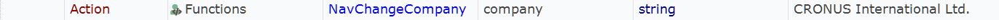
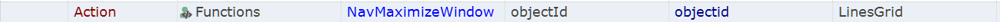

# Overview

Framework for testing Dynamics NAV 2017-2018 RoleTailored Client.

- Reusable functions are defined in `User.js`.
- Data for each test case is defined in `Data.xlsx`.
- `Dropdowns.xlsx` contains lists of values for RVL dropdowns.
- `Output.xlsx` is used to persist data between test executions.

## Common Functions

All functions are defined in `User.js`. Look into this file for details.

### NavLaunch

Launches Dynamics NAV desktop client and waits for it to show up on screen.

### NavVersion

Returns NAV version (2017 - 100, 2018 - 110).

### NavClose

Closes Dynamics NAV desktop client.

### NavChangeCompany

Changes current company. Specify name of a company to open.

### NavNavigate

Navigates to a specific page using address bar.

### NavFilterGrid

Applies a filter to table data.

### NavSelectFastTab

Selects Fast Tab with a given name.

### NavMaximizeWindow

Maximizes window with a given object.

### NavMakeFileName

Builds full file path.

### NavPrintPdf

Prints/saves document to PDF into OutputFiles folder. 

Open this dialog before calling the function.

### NavAddColumns

Ensures that specific columns are visible. When you call this function the grid should be visible on screen.

### NavRemoveColumns

Ensures that specific columns are NOT visible. When you call this function the grid should be visible on screen.

### SetOutputValue

Writes key/value pair to Output.xlsx

### GetOutputValue

Reads value from Output.xlsx

